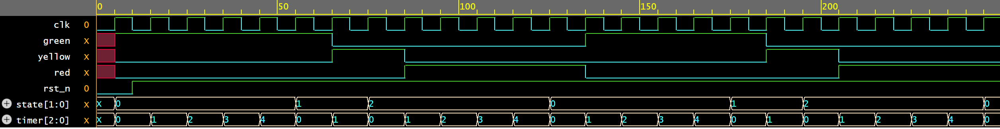

# Traffic Light Controller

## Description
A Traffic Light Controller designed in Verilog using a 
Finite State Machine (FSM). Cycles through GREEN, YELLOW, 
and RED states with configurable timer durations.

## Specifications
- GREEN duration: 5 clock cycles
- YELLOW duration: 2 clock cycles
- RED duration: 5 clock cycles
- Active low reset

## Ports
| Signal | Direction | Description |
|--------|-----------|-------------|
| clk | Input | Clock |
| rst_n | Input | Active low reset |
| red | Output | Red light signal |
| yellow | Output | Yellow light signal |
| green | Output | Green light signal |

## FSM States
| State | Duration | Description |
|-------|----------|-------------|
| GREEN | 5 cycles | Green light ON |
| YELLOW | 2 cycles | Yellow light ON |
| RED | 5 cycles | Red light ON |

## How to Simulate
1. Open [EDA Playground](your-link-here)
2. Paste traffic_light.sv in Design tab
3. Paste tb_traffic_light.sv in Testbench tab
4. Select Icarus Verilog 0.9.7
5. Check Open EPWave after run
6. Click Run

## Waveform

## What I learned
- Timer-based FSM design in Verilog
- How to control state duration using a counter
- Moore FSM — outputs depend only on current state
